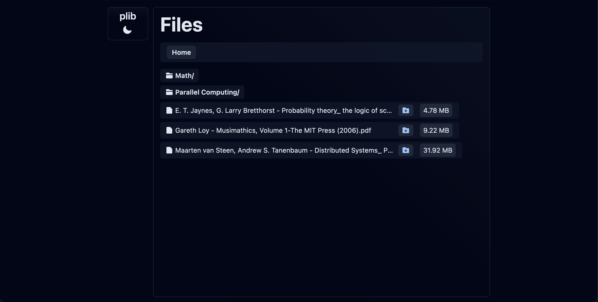

# plib

A personal webapp to download items from an S3 bucket.

## Stack

- React.js
- CloudFlare functions

## Requirements

- AWS Cognito User / Identity Pool
- AWS S3
  - Necessary IAM Policies: List, Get
- CloudFlare account

## Deployment

- Deploy using [CloudFlare Pages](https://developers.cloudflare.com/pages/framework-guides/deploy-anything)

## Development

- configure `.dev.vars` for CloudFlare Functions
- `npm run pdev` to run server in development mode
